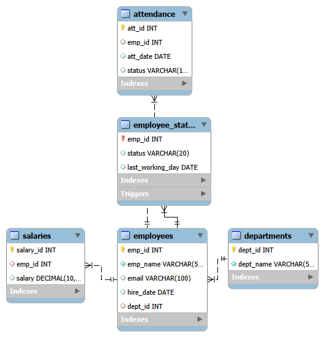
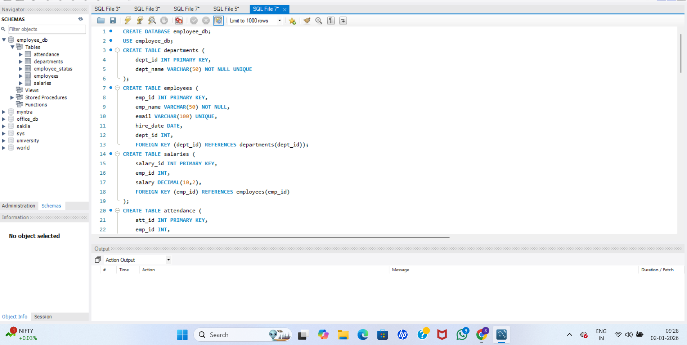
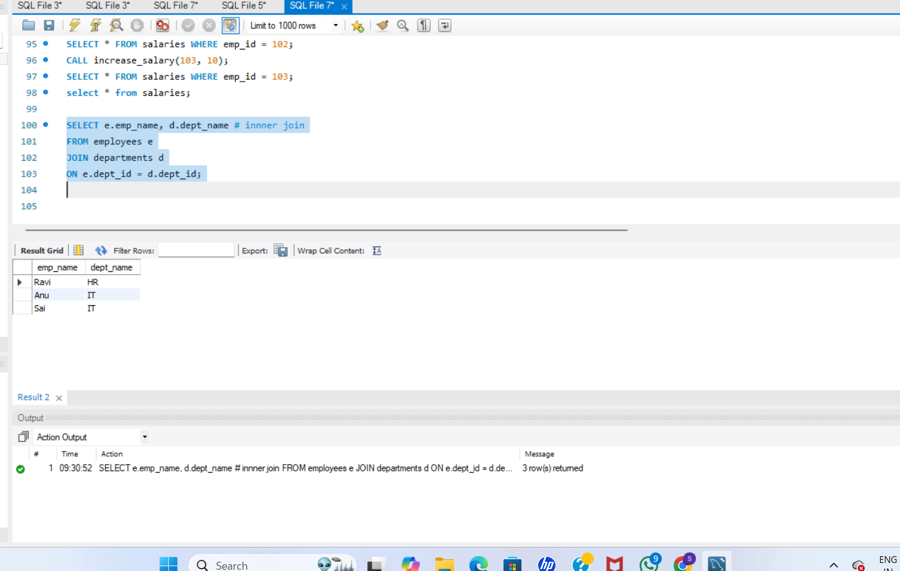
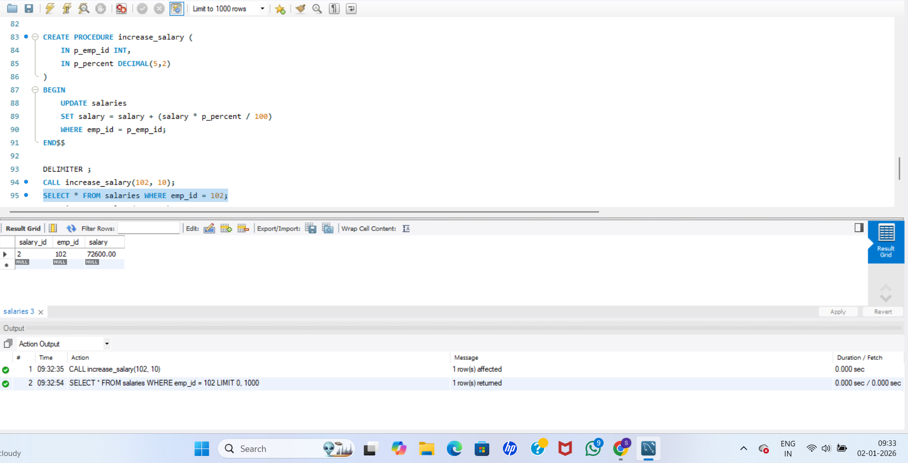
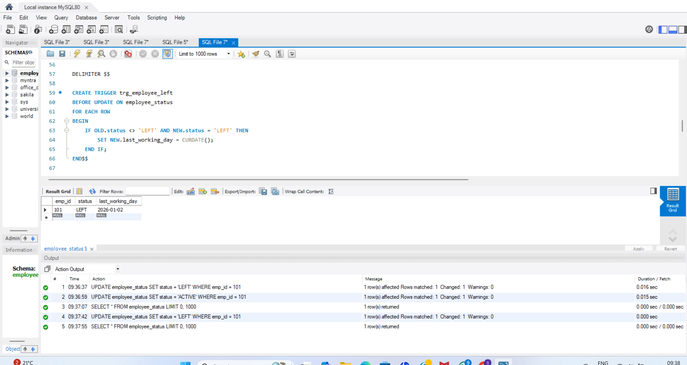

# Employee Management System – SQL Project

## 📌 Project Description
This project is a MySQL-based Employee Management System designed to manage
employees, departments, salaries, attendance, and employee status.
It demonstrates core SQL concepts used in real-world applications.

## 🛠️ Technologies Used
- MySQL
- MySQL Workbench

## 🧱 Database Design
Tables used:
- departments
- employees
- salaries
- attendance
- employee_status

Relationships:
- One department → Many employees
- One employee → One salary
- One employee → Many attendance records
- One employee → One status

## ✨ Features
- Relational database design using primary & foreign keys
- Data integrity using constraints
- Joins and subqueries for reporting
- Trigger to handle employee exit process
- Stored procedure for salary increment
- Data cleanup using DELETE, TRUNCATE, DROP

## ⚡ SQL Concepts Covered
- DDL (CREATE, DROP)
- DML (INSERT, UPDATE, DELETE)
- Joins
- Subqueries
- Triggers
- Stored Procedures
- Constraints

## 🚀 How to Run
1. Open MySQL Workbench
2. Execute the SQL file: `employee_management.sql`
3. Run queries step by step
## 🧩 ER Diagram

## 📸 Screenshots

### Database Tables

### INNER JOIN Query

### Stored Procedure Execution

### Trigger Execution

